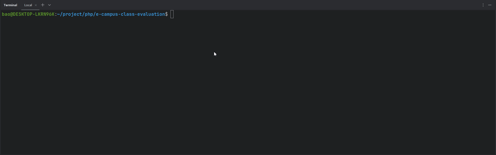

# 专家听评课管理系统

## 功能

主要功能介绍：

### 用户

- 教师
    - [x] 听评课记录列表、查看
- 专家
    - [x] 听评课记录列表、查看
    - [x] 添加听评课记录
- 管理人员
    - [x] 听评课记录列表、查看、导出

### 系统管理员

- 评课设置
    - [x] 指标管理
    - [x] 学年学期管理
    - [x] 课程列表
- 专家管理
    - [x] 专家类型管理：增删改查
    - [x] 专家管理：：增删改查
- 管理人员
    - [x] 管理人员类型管理：增删改查
    - [x] 管理人员管理：：增删改查
- 听课记录
    - [x] 听课记录列表、查看
    - [x] 数据导出

## 运行 Demo

克隆代码：

```shell
git clone https://github.com/hefengbao/e-campus-class-evaluation.git ce
````

进入项目目录：

```shell
cd ce
```

安装依赖：

```shell
composer install
```

基础配置：

```shell
cp .env.example .env
php artisan key:generate
php artisan storage:link
```

迁移数据表：

```shell
php artisan migrate
```

填充测试数据：

```shell
php artisan db:seed --class=UserSeeder
php artisan db:seed --class=MetricSeeder
php artisan db:seed --class=TimetableSeeder
php artisan db:seed --class=ExpertTypeSeeder
php artisan db:seed --class=ManagerTypeSeeder
```

初始化【超级管理员】：

```shell
php artisan app:init-admin
```



```shell
php artisan serve
```

访问（示例地址）：`http://127.0.0.1:8000` 、 `http://127.0.0.1:8000/admin` 。
